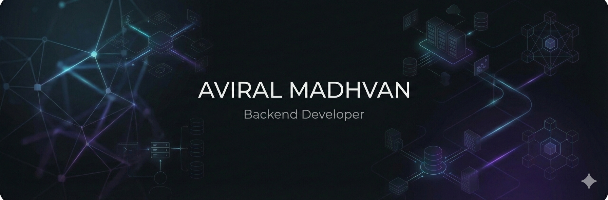
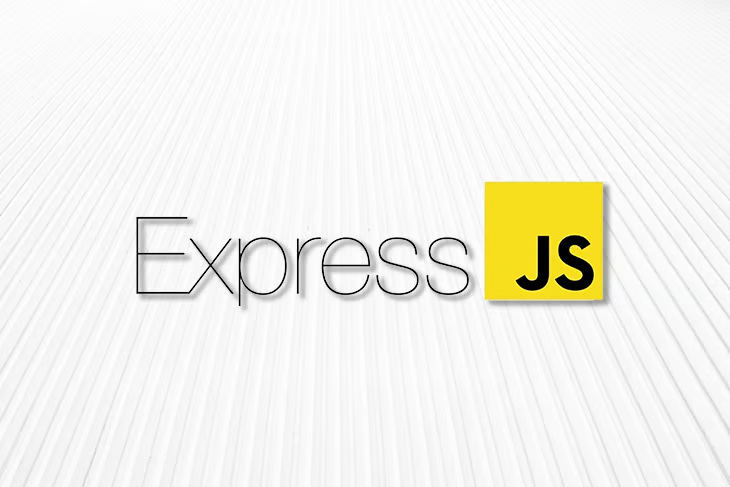
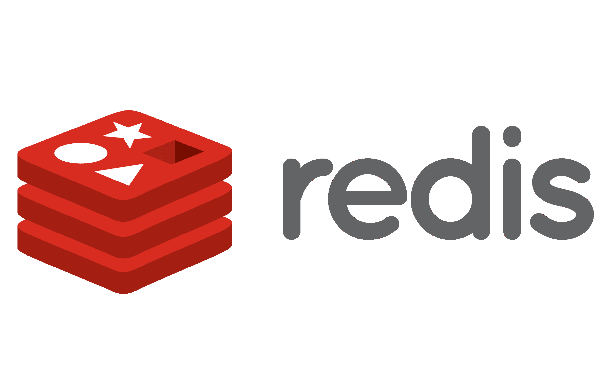

# <b>Hi there, I'm </b><a href="https://github.com/aviralMadhvan24">Aviral Madhvan</a>

## About Me

I am a <b>Computer Science & Engineering student</b> (Class of 2028) focused on <b>backend engineering</b>.
I currently serve as the <b>Founder & Tech Lead of Click2Biz</b>, where I design and build real-world SaaS systems involving
authentication, dashboards, payments, background queues, and scalable APIs.
  
I enjoy working close to the backend—designing clean APIs, managing data flows, and ensuring systems behave reliably under load.

## Tech Stack I Use

<table align="center">
  <tr>
    <th colspan="4" align="center">Languages & Blockchain</th>
  </tr>
  <tr>
    <td align="center" width="120"> JavaScript</td>
    <td align="center" width="120"> TypeScript</td>
    <td align="center" width="120"> Solidity</td>
    <td align="center" width="120"> Ethereum</td>
  </tr>

  <tr>
    <th colspan="4" align="center">Frontend & Backend</th>
  </tr>
  <tr>
    <td align="center"> React</td>
    <td align="center"> Next.js</td>
    <td align="center"> Node.js</td>
    <td align="center"> Express.js</td>
  </tr>

  <tr>
    <th colspan="4" align="center">Databases & Caching</th>
  </tr>
  <tr>
    <td align="center"> MongoDB</td>
    <td align="center"> PostgreSQL</td>
    <td align="center"> Redis</td>
    <td align="center"> Prisma</td>
  </tr>

  <tr>
    <th colspan="4" align="center">Infrastructure & Tools</th>
  </tr>
  <tr>
    <td align="center"> Docker</td>
    <td align="center"> BullMQ</td>
    <td align="center"> Firebase</td>
    <td align="center"> Postman</td>
  </tr>

  <tr>
    <th colspan="4" align="center">Web3 & Auth</th>
  </tr>
  <tr>
    <td align="center"> MetaMask</td>
    <td align="center"> Hardhat</td>
    <td colspan="2"></td>
  </tr>
</table>

## Projects & Work

### Click2Biz — Founder & Tech Lead
- Designed and implemented client and admin dashboards  
- Built authentication, purchase flows, and service progress tracking  
- Implemented background job queues for asynchronous processing  
- Integrated Web3 and modern backend tooling  
- Emphasis on clean architecture, data consistency, and scalability  

**Live Website:** https://www.click2biz.in/

### Niyati Group — Website Project

Developed the official website for **Niyati Group**, a tax consultancy and job recruitment firm serving clients across India.  
The site focuses on clear service presentation, trust-building, and accessibility for non-technical users.

**Tech Stack:** React, Firebase  

**Live Website:** https://www.niyatigroup.co.in/

## Contact

- GitHub: https://github.com/aviralMadhvan24  
- LinkedIn: https://www.linkedin.com/in/aviral-madhvan-801481218/
- Email: aviralmadhvan@gmail.com  

